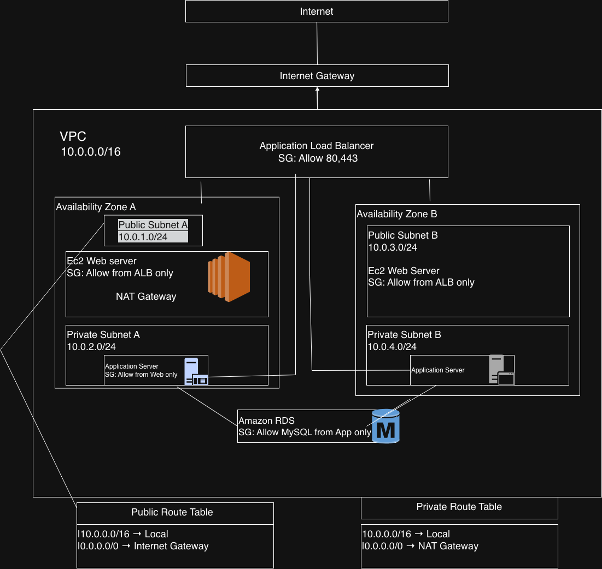

# Project 1 – AWS Production Network Design
# AWS Highly Available 3-Tier Architecture

## Project Overview
This project demonstrates the design of a secure, scalable and highly available AWS network for a production e-commerce application.

The architecture follows AWS networking best practices by separating public and private resources, implementing layered security, and providing high availability across multiple Availability Zones.
## Project Objectives
- Design a secure AWS Virtual Private Cloud (VPC)
- Separate public and private resources using subnets
- Protect resources using Security Groups
- Provide Internet access through an Internet Gateway
- Allow private resources outbound Internet access using a NAT Gateway
- Implement High Availability using multiple Availability Zones
- Distribute traffic using an Application Load Balancer
## AWS Services Used
| AWS Service | Purpose |
|-------------|---------|
| VPC | Creates an isolated private network |
| Public Subnet | Hosts Internet-facing resources |
| Private Subnet | Hosts internal application resources |
| Internet Gateway | Connects the VPC to the Internet |
| Route Tables | Controls network routing |
| Security Groups | Acts as a virtual firewall |
| NAT Gateway | Allows outbound Internet access from private resources |
| Application Load Balancer | Distributes traffic across web servers |
| EC2 | Hosts web and application servers |

## Architecture Components
- One VPC (10.0.0.0/16)
- Public Subnet
- Private Subnet
- Internet Gateway
- Public Route Table
- Private Route Table
- Security Groups
- NAT Gateway
- Application Load Balancer
- Two Web Servers
- Application Server
- Database

## Skills Demonstrated
- AWS Networking
- CIDR Planning
- Public and Private Subnets
- Internet Gateway
- Route Tables
- Security Groups
- NAT Gateway
- High Availability
- Application Load Balancer
- Network Troubleshooting
